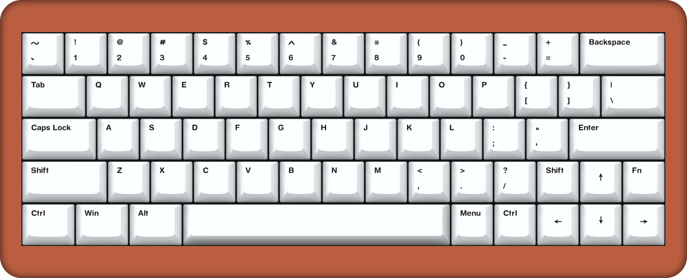

# VR64-Keyboard-PCB

## Intent

A 64-key Hall Effect *(**HE**)* keyboard with QMK f/w, build on a GH60/Bakeneko PCB footprint.

## Layout ideation renders

#### Render

## Planned Features

- [ ] QMK build
- [ ] MCU `STM32` *of sorts.  TBD.*
- [ ] C3/4 UDB Usb-C, option
- [ ] Hotswap MX HE switches

## Wish List

- .. just HE .. *(See [Possible BIG issues](#possible_big_issues) )*

## Possible BIG issues

- HE !!
    1. QNK does not have a native HE implementation
    2. ... one will need to be built
    3. In this build - how do we address **individual** switch calibration?
        - **Idea:** Dynamicly keep a list of MIN & MAX read values and program the code to be based on percentage values of each key's MIN MAX.  Dynamically update those values over usage for a "self calibration" feature.  But ... how do we manage:
            1. age
            2. default values at startup
            3. EEPROM retention may be adverse on storage longevity 
    4. For future ref., see how others have done it:
       - **Keychron:** https://github.com/Keychron/qmk_firmware/tree/hall_effect_playground/keyboards/keychron
       - **[&#64;RephlexZero](https://github.com/RephlexZero):**  https://github.com/RephlexZero/qmk_firmware/tree/moonboard/keyboards/rephlex/moonboard 
- Is the 0.25U offset ZXCVBN row personally off-putting?

&nbsp; &nbsp;

---
Made with &#9829; by Vino Rodrigues
